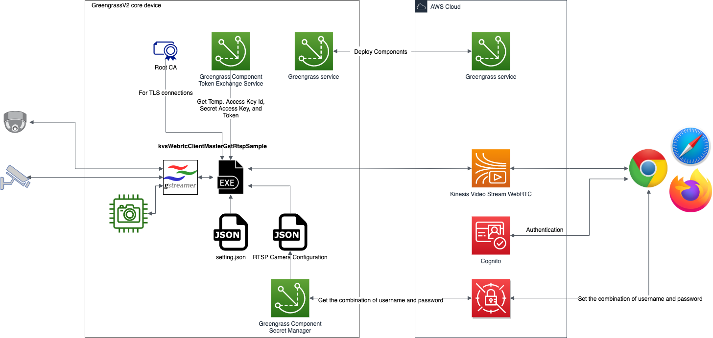

# aws-greengrass-labs-webrtc

This is an application that runs on [AWS IoT Greengrass v2](https://docs.aws.amazon.com/greengrass/v2/developerguide/what-is-iot-greengrass.html) gateway devices as a [Greengrass Component](https://docs.aws.amazon.com/greengrass/v2/developerguide/manage-components.html).  The app receives video streams from multiple IP cameras, allowing remote viewers to watch the streams using [Amazon Kinesis Video Stream WebRTC](https://github.com/awslabs/amazon-kinesis-video-streams-webrtc-sdk-c).

## Prerequisite Setup

- GreenGrassV2
  Please setup your device if it does not have Greengrass v2. See [Install the AWS IoT Greengrass Core software](https://docs.aws.amazon.com/greengrass/v2/developerguide/install-greengrass-core-v2.html).
- GStreamer
  GStreamer should be installed on the device.  GStreamer is a pipeline-based multimedia framework. This app uses its plugin, [rtspsrc](https://gstreamer.freedesktop.org/documentation/rtsp/rtspsrc.html?gi-language=c), to receive video streams from RTSP cameras. See[ Installing GStreamer](https://gstreamer.freedesktop.org/documentation/installing/index.html?gi-language=c).
- Python3
  We use [aws-iot-device-sdk-python-v2](https://github.com/aws/aws-iot-device-sdk-python-v2) on the GreengrassV2 devices, so you need to install Python3.
- AWS Command Line Interface (CLI)
  We provide bash shell scripts based on AWS CLI for installing and configuring the app.  Please install AWS CLI on your desktop PC following [Configuring the AWS CLI](https://docs.aws.amazon.com/cli/latest/userguide/cli-chap-configure.html).
- jq
  Our shell scripts are based on jq. See [Download jq](https://stedolan.github.io/jq/download/)

## Architecture



## Build and Install the App

Please build the image by following these steps.  The app links to GStreamer dynamically, therefore you MUST have the dynamically linked libraries of GStreamer on your devices. (See Prerequisite Setup.)

 After cloning this project:

```
$git submodule update --init
$cd source/amazon-kinesis-video-streams-webrtc-sdk-c
$git apply --ignore-whitespace ../patches/0001-ecs-support.patch
$cd ..
$mkdir build && cd build && cmake ..
$make
$cp awsGreengrassLabsWebRTC your-artifact-path
```

## Build Unit Tests

### Checkout CMock Submodule

To build unit tests, the submodule dependency of CMock is required. Use the following command to clone the submodule:

```
$git submodule update --checkout --init --recursive source/test/unit-test/CMock
```

### Platform Prerequisites

- For running unit tests
  - **C90 compiler** like gcc
  - **CMake 3.13.0 or later**
  - **Ruby 2.0.0 or later** is additionally required for the CMock test framework (that we use).
- For running the coverage target, **gcov** and **lcov** are additionally required.

### Steps to build **Unit Tests**

1. Run the steps of Build and go to the source folder under the root directory of this repository. (Make sure that the **CMock** submodule is cloned as described)
2. Run the *cmake* command: `cmake -S test -B build`
3. Run this command to build the library and unit tests: `make -C build all`
4. The generated test executables will be present in `build/bin/tests` folder.
5. Run `cd build && ctest` to execute all tests and view the test run summary.

## **Configure Greengrass**

We provide three shell scripts for generating all artifacts.  To use these scripts, you need to provide the configuration of RTSP cameras and the name of your IoT Thing for the Greengrass device.

 Step. 1: Generate resources in AWS cloud for consuming video streams through WebRTC.  You must provide all arguments needed by the script.  This script will create policies and AWS resources (such as S3 bucket and AWS Secrets Manager resources) in your AWS account.  It also generates artifact files and a [recipe ](https://docs.aws.amazon.com/greengrass/v2/developerguide/component-recipe-reference.html)for the Greengrass app.

```
$bash scripts/generate-iot-greengrass.sh $aws_profile $iot_thing_name $component_name $component_version $your_s3_bucket_for_artifacts $secret_name $the-configuration-of-your-cameras $os $architecture
```

The example for Raspberry Pi 4 Model B:

```
$bash scripts/generate-iot-greengrass.sh default MyGreengrassCore aws.greengrass.labs.webrtc 1.0.0 aws-greengrass-labs-webrtc-bucket aws-greengrass-labs-webrtc-secret rtsp-camera-configuration.json linux armv7l
```

The example for Greengrass devices running Ubuntu 18.04:

```
$bash scripts/generate-iot-greengrass.sh default MyGreengrassCore aws.greengrass.labs.webrtc 1.0.0 aws-greengrass-labs-webrtc-bucket aws-greengrass-labs-webrtc-secret rtsp-camera-configuration.json linux x64
```

Step. 2: Upload the app.  This app is built as a Greengrass v2 “component”. Please remember putting your awsGreengrassLabsWebRTC into artificats folder.

```
$bash scripts/upload-component-version.sh $WorkPath $aws_profile $component_name $component_version $your_s3_bucket_for_artifacts
```

Example:

```
$bash scripts/upload-component-version.sh . default aws.greengrass.labs.webrtc 1.0.0 aws-greengrass-labs-webrtc-bucket
```

Step. 3: Deploy this app along with other depended Greengrass components (Token Exchange Service and Secret Manager.)

```
$bash scripts/deploy-component.sh $aws_profile $iot_thing_name $component_name $component_version $your_s3_bucket_for_artifacts $secret_name
```

Example:

```
$bash scripts/deploy-component.sh default MyGreengrassCore aws.greengrass.labs.webrtc 1.0.0 aws-greengrass-labs-webrtc-bucket aws-greengrass-labs-webrtc-secret
```

## **Configure RTSP Cameras**

In Step 1 of Configure Greengrass above, you need to provide a configuration file in JSON format.  (This is the “`$the-configuration-of-your-cameras`” argument for `generate-iot-greengrass.sh`.)  In this JSON file, you provide the username, password and URL of each camera.  The "ChannelName" is the name of the WebRTC channel you want to associate to the camera. A viewer will use that name to find that camera.

```
{
  "RtspConfig": [
    {
      "ChannelName": "the signaling channel of webrtc corresponds to your rtsp camera",
      "RtspUrl": "the uri your rtsp camera",
      "username": "the username of your rtsp camera",
      "password": "the password of your rtsp camera"
    },
    {
      "ChannelName": "the signaling channel of webrtc corresponds to your rtsp camera",
      "RtspUrl": "the uri your rtsp camera",
      "username": "the username of your rtsp camera",
      "password": "the password of your rtsp camera"
    }
  ]
}
```

## **Optional - Use Greengrass Console to Deploy**

If you do not use scripts/deploy-component.sh, but use the Greengrass console to deploy this app, you MUST add the following “merge” blocks in your deployment configuration.  (See [Configuration merge update](https://docs.aws.amazon.com/greengrass/v2/developerguide/update-component-configurations.html).)

 For AWS secret manager.

```
"merge": {
    "cloudSecrets":[{"arn": "$SecretTargetArn"}]}"
}
```

For this app (component).

```
"merge": {
    "IpcTimeout" : "10",
    "RecipesBucketName" : "$ComponentArtifactsBucket",
    "SecretArn": "$SecretName",
    "accessControl": {
        "aws.greengrass.SecretManager": {
            "$ComponentName:secrets:1": {
                "policyDescription": "Allows access to a secret.",
                "operations": [ "aws.greengrass#GetSecretValue"],
                "resources": [ "*"]
            }
        }
    }
}
```

## **Dependencies**

- Python plugins. These two are automatically installed if you use the provided scripts.
  - [aws-iot-device-sdk-python-v2](https://github.com/aws/aws-iot-device-sdk-python-v2). Used for [interprocess communication](https://docs.aws.amazon.com/greengrass/v2/developerguide/interprocess-communication.html)
  - [netifaces](https://pypi.org/project/netifaces/)
- Gtreamer, used for rtsp client. You need to install GStreamer by yourself. The version of GStreamer we’ve tested is 1.14.4. The dynamic libraries of GStreamer this app links to are:

```
libgstreamer-1.0.so.0
libgstapp-1.0.so.0
libgstbase-1.0.so.0
```

- Greengrass components, When you deploy this component, you MUST deploy the following components.
  - [Token Exchange Service](https://docs.aws.amazon.com/greengrass/v2/developerguide/token-exchange-service-component.html)
  - [Secret Manager](https://docs.aws.amazon.com/greengrass/v2/developerguide/secret-manager-component.html)

## Appendix A - Install Greengrass v2 Manually

If you want to install Greengrass v2 on a device manually, you can type the following command after  scripts/generate-iot-greengrass.sh generates the config.yaml, certificate and other necessary resources.

```
$. scripts/install-ggv2-ssh.sh $user $ip_address
```

## Security

See [CONTRIBUTING](CONTRIBUTING.md#security-issue-notifications) for more information.

## License

This project is licensed under the Apache-2.0 License.

